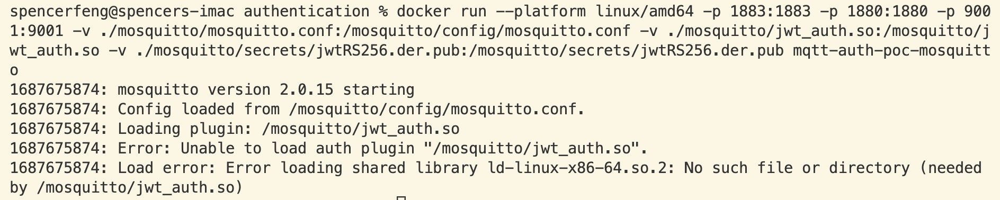
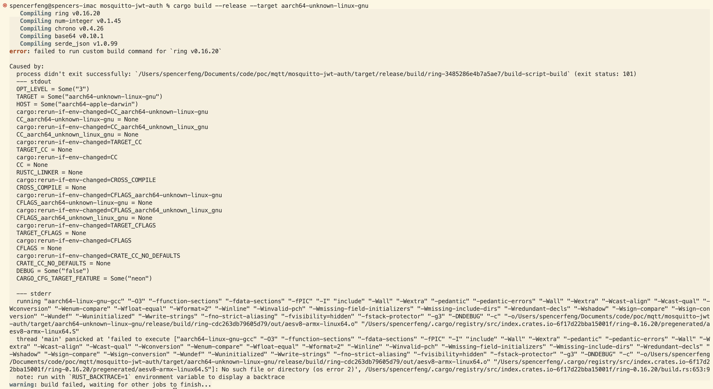

# Outcome

## Summary

The experiment does not achieve the expected result. 

* The auth plugin can not be loaded because it needs the shared libary ld-linux-x86-64.so



## Possible reason

* The jwt_auth.so used in this experiment is downloaded from [here](https://github.com/wiomoc/mosquitto-jwt-auth/releases/download/0.4.0/libmosquitto_jwt_auth.so) and it is built for linux.
* The docker image is built using my M1 Mac which is in ARM64 architecture

## What have been tried

* Build the plugin written in Rust for ARM architecture locally. But it is unsuccessful.
  * **step 1**
  ```bash
    rustup target add aarch64-unknown-linux-gnu
  ```
  * **step 2**
  ```bash
    cargo build --release --target aarch64-unknown-linux-gnu
  ```
  


